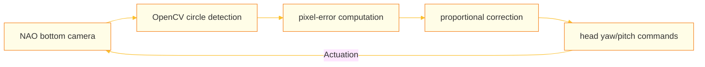

<p align="center">
  
</p>

# NAO Ball Pickup

> Ball detection, head tracking, and a fixed-pose pickup motion for the SoftBank NAO 6 humanoid robot — HSV color segmentation, proportional head control, and a 23-joint Choregraphe keyframe sequence.

[](https://github.com/mtorun0x7cd/nao-ball-pickup/actions/workflows/ci.yml)


---

## Overview

This project implements a perception-action pipeline for the SoftBank NAO 6 humanoid robot: it detects a colored ball on the ground, tracks it with head movements, and executes a full-body pickup motion. The system combines computer vision with proportional head control and a choreographed multi-joint animation on a 25-DOF bipedal platform (25 of the robot's 26 joints are actuated). Its scope is deliberately narrow — the ball is hand-placed within a fixed reachable zone and the robot neither searches for nor walks toward it; the project report frames the outcome as a working but limited first attempt.

The vision pipeline operates on VGA frames (640×480) streamed from the robot's bottom camera via the NAOqi SDK. Each frame undergoes Gaussian blur, BGR-to-HSV conversion, `inRange` thresholding, and morphological filtering (erosion + dilation) to isolate the target ball. Contour extraction followed by minimum-enclosing-circle computation yields the ball's pixel-space position and apparent radius. A proportional feedback term then drives the head yaw and pitch angles to center the ball in the field of view.

Once the ball is centered and the head angles fall within fixed thresholds, an event-driven observer (`EventHook`) triggers a 9-keyframe pickup animation spanning 23 joints. The motion is interpolated via `ALMotion.angleInterpolation()`, after which the robot returns to a standing posture.

Because all image processing runs on a remote PC rather than on the robot, end-to-end throughput is bounded by the NAOqi image-transfer rate: the camera is subscribed at 30 fps, but the project report measured an effective rate of roughly 1 fps over wireless and 2–4 fps over a wired link.

The committed source is preserved as-is from its student-project state. It targets Python 2.7 and the NAOqi SDK and carries known defects — for example an unset `motion_speed` in `Robot.start` and a frame-tuple arity mismatch in `VideoStream` — so it does not run unmodified; it is archived for reference rather than as a runnable package.

## Context

| Dimension | Detail |
| :--- | :--- |
| **Institution** | TH Köln (Cologne University of Applied Sciences) |
| **Program** | Computer Science and Systems Engineering (M.Sc.) |
| **Course** | Special Aspects of Mobile Autonomous Systems |
| **Semester** | Winter 2021/2022 |
| **Type** | Team |

## Features

- **Threaded camera streaming** — A dedicated `VideoStream` thread subscribes to the NAOqi `ALVideoDevice` API at VGA resolution and a requested 30 fps, dispatching each frame as an event. Both cameras are subscribed, but only the bottom camera's acquisition thread is started — the reachable floor area lies outside the top camera's field of view.
- **HSV color-space ball detection** — Gaussian blur → HSV conversion → `inRange` thresholding → erosion/dilation → contour extraction → minimum-enclosing-circle computation, calibrated for an orange test ball
- **Proportional head tracking** — An inline proportional correction (`Δangle = 0.007 · pixel_error`) drives the head yaw and pitch to center the ball on pixel coordinate `(320, 240)`, with a ±10 px dead zone per axis to suppress jitter
- **23-joint keyframe animation** — A 9-keyframe pickup sequence across both arms, both legs, and the hip joints, authored in Choregraphe's animation mode and interpolated via `angleInterpolation` for smooth full-body motion
- **Event-driven architecture** — A custom `EventHook` observer (with `+=` / `-=` syntax) decouples camera frames from detection (`ImageEvent`) and detection from the pickup trigger (`CanPickup`)
- **HSV calibration utility** — An interactive trackbar tool (`checkHSV.py`) for tuning color thresholds on a live webcam or a static image in either RGB or HSV color space
- **Threshold-gated pickup** — The pickup motion fires only when the ball's horizontal pixel position and the head yaw and pitch simultaneously fall within fixed threshold windows; the vertical-pixel check is computed for logging but excluded from the firing condition

## Architecture

The system follows a pipeline architecture with event-driven data flow between decoupled components:

```
┌─────────────┐     ImageEvent      ┌─────────────────┐    followBall()    ┌───────────────┐
│ VideoStream │ ──────────────────► │   Recognition   │ ─────────────────► │ Head Tracking │
│  (Thread)   │   fire(image,w,h)   │  HSV + Contours │   setHeadAngle()   │ (P, Yaw/Pitch)│
└─────────────┘                     └────────┬────────┘                    └───────────────┘
       ▲                                     │
       │                                     │ CanPickup.fire()
       ▼                                     ▼
  NAOqi Camera                       ┌───────────────┐
  ALVideoDevice                      │     Robot     │
                                     │ initPickup()  │
                                     │ 23-joint, 9KF │
                                     └───────────────┘
```

### Signal Flow Diagram



### Component Breakdown

| Module | Responsibility |
|--------|---------------|
| `main.py` | Entry point — instantiates `Robot` and `Recognition`, starts the pipeline |
| `robot.py` | NAOqi proxy management, head angle control, 23-joint pickup keyframe sequence |
| `VideoStream.py` | Threaded camera subscription via `ALVideoDevice`, frame acquisition, event dispatch |
| `recognition.py` | HSV masking, contour detection, ball position extraction, proportional head tracking |
| `Controller.py` | Generic PD controller class with configurable gains and output clamping (see note below) |
| `EventHook.py` | Observer pattern for decoupled event propagation (`+=` / `-=` syntax) |
| `tools/checkHSV.py` | Standalone HSV/RGB calibration utility with OpenCV trackbars |

### Head Tracking

Head tracking keeps the detected ball centered on `(320, 240)` in the 640×480 VGA frame. When the ball leaves the dead zone, `recognition.py::followBall` applies an inline proportional correction to the head angles:

- **Target**: ball centered on `(320, 240)`
- **Dead zone**: ±10 px on each axis — suppresses jitter when the ball is approximately centered
- **Correction**: `Δyaw = 0.007 · (x − 320)`, `Δpitch = −0.007 · (y − 240)` — pure proportional, with no output clamping in the shipped path
- **Update rate**: tied to the effective camera throughput (≈1–4 fps under the remote-processing setup, not the nominal 30 fps subscription)

A generic proportional-derivative controller is provided separately in `Controller.py`:

$$u = K_p\,e + K_d\,(e_{t-1} - e_t)$$

`Recognition.__init__` constructs two `PD` instances (`P = 0.005`, `D = 0`, output clamp `0.15`), and the project report describes the angle correction as PD control. In the committed source, however, those instances are not invoked by `followBall`, so the executed controller is the proportional term above (gain `0.007`); with `D = 0` the class would in any case reduce to proportional control. The `PD` class remains available for callers that wish to use it.

### Keyframe Animation

The pickup motion is a 9-keyframe sequence across 23 joints (both arms, both legs, hip), authored in Choregraphe's animation mode by recording intermediate poses and reading out their joint angles:

- **Timeline**: keyframes at `t = [4, 8, 12, 16, 20, 22, 26, 30, 34]` (NAOqi time units)
- **Joints**: `LHand`, `RHand`, `L/RAnklePitch`, `L/RAnkleRoll`, `L/RElbowRoll`, `L/RElbowYaw`, `L/RHipPitch`, `L/RHipRoll`, `LHipYawPitch`, `L/RKneePitch`, `L/RShoulderPitch`, `L/RShoulderRoll`, `L/RWristYaw`
- **Execution**: interpolated via `ALMotion.angleInterpolation()`
- **Post-motion**: the robot transitions to a `Crouch` posture, then back to `Stand`

Design-time intermediate poses are tabulated in [the joint-positions reference](docs/Project_JointPositions%20-%20Project_JointPositions.pdf); the shipped keyframe arrays were further hand-tuned and diverge from it (the reference lists five poses to the code's nine, and several joints — including the hand open/close states — differ).

## Tech Stack

| Category | Technologies |
|----------|-------------|
| Language | Python 2.7.0 |
| Vision | OpenCV 4.2.0, NumPy, Pillow, imutils |
| Robot SDK | NAOqi (`ALMotion`, `ALVideoDevice`, `ALRobotPosture`, `ALMemory`) |
| Motion authoring | Choregraphe (animation mode) |
| Robot | SoftBank NAO 6 |
| Control | Inline proportional head tracking; generic PD controller class |
| Pattern | Observer (`EventHook`) |

## Project Structure

```
nao-ball-pickup/
├── src/
│   ├── main.py            # Entry point
│   ├── robot.py           # NAOqi proxy management and keyframe animation
│   ├── recognition.py     # HSV detection and proportional head tracking
│   ├── Controller.py      # Generic PD controller class
│   ├── EventHook.py       # Observer pattern implementation
│   ├── VideoStream.py     # Threaded camera stream
│   └── tools/
│       └── checkHSV.py    # HSV calibration utility
├── docs/
│   ├── social_preview.svg # Repository header graphic (theme-adaptive)
│   └── *.pdf              # Report, presentation, project idea, joint-position reference
├── .github/workflows/     # CI pipeline
├── CITATION.cff
├── SECURITY.md
├── LICENSE
└── README.md
```

(Repository dotfiles — `.gitignore`, `.gitattributes`, `.editorconfig` — are omitted from this view.)

## Getting Started

### Prerequisites

- A SoftBank NAO 6 robot accessible on the local network
- Python 2.7 with the NAOqi Python SDK installed ([pynaoqi installation guide](http://doc.aldebaran.com/2-1/dev/python/install_guide.html))
- OpenCV with Python bindings, plus NumPy, Pillow, and imutils

### Installation

```bash
pip install opencv-python numpy Pillow imutils
```

### Configuration

1. Set the robot IP address in `src/main.py`:
   ```python
   robot = Robot("<robot-ip>", 9559)
   ```

2. (Optional) Calibrate ball color thresholds using the HSV tool:
   ```bash
   python src/tools/checkHSV.py -f HSV -w -p
   ```
   Then update `HSV_MIN` and `HSV_MAX` in `src/recognition.py`.

### Run

```bash
export PYTHONPATH=/path/to/pynaoqi-python2.7-<version>-linux64:$PYTHONPATH
python src/main.py
```

## Documentation

| Document | Description |
|----------|-------------|
| [Report.pdf](docs/Report.pdf) | Full technical report covering design, implementation, and results |
| [Project presentation.pdf](docs/Project%20presentation.pdf) | Slide deck summarizing the approach and findings |
| [Project idea.pdf](docs/Project%20idea.pdf) | Initial project proposal |
| [Joint Positions Reference](docs/Project_JointPositions%20-%20Project_JointPositions.pdf) | NAO joint-position data used for keyframe design |

## References

[1] K. J. Åström and R. M. Murray, *Feedback Systems: An Introduction for Scientists and Engineers*, Princeton University Press, 2008.

[2] OpenCV Documentation, "Color Space Conversions," [https://docs.opencv.org/4.x/de/d25/imgproc_color_conversions.html](https://docs.opencv.org/4.x/de/d25/imgproc_color_conversions.html)

[3] SoftBank Robotics, "NAOqi Developer Guide," [http://doc.aldebaran.com/2-1/index_dev_guide.html](http://doc.aldebaran.com/2-1/index_dev_guide.html)

[4] SoftBank Robotics, "ALMotion API — angleInterpolation," [http://doc.aldebaran.com/2-1/naoqi/motion/control-joint-api.html](http://doc.aldebaran.com/2-1/naoqi/motion/control-joint-api.html)

[5] SoftBank Robotics, "Choregraphe Suite," [http://doc.aldebaran.com/2-1/software/choregraphe/index.html](http://doc.aldebaran.com/2-1/software/choregraphe/index.html)

[6] R. Szeliski, *Computer Vision: Algorithms and Applications*, Springer, 2010. Chapter 2.3: Color Spaces (HSV).

## Citation

Citation metadata is provided in [`CITATION.cff`](CITATION.cff); GitHub renders a *Cite this repository* action from it.

## Security

This is an archived academic project and is not actively maintained. It connects to a NAO robot over the local network via the NAOqi protocol with no application-level authentication in this configuration, and expects a placeholder robot IP, not live credentials. It has not undergone a security review and must not be exposed beyond a trusted lab network. See [`SECURITY.md`](SECURITY.md) for details.

## License

This project is licensed under the MIT License — see the [LICENSE](LICENSE) file for details.

## Author

**Mert Torun, M.Sc.** — IT Security Architect & Systems Engineer  
mtorun0x7cd · Research & Development

His work spans the verification and validation of safety-critical systems, infrastructure hardening, and cryptographic integrity, grounded in an M.Sc. in Computer Science and Systems Engineering from TH Köln. This repository is preserved as a record of a completed project rather than maintained as a living tool.

- **Email**: [info@mtorun0x7cd.com](mailto:info@mtorun0x7cd.com)
- **Website**: [mtorun0x7cd.com](https://mtorun0x7cd.com)
- **LinkedIn**: [linkedin.com/in/mtorun0x7cd](https://linkedin.com/in/mtorun0x7cd)
- **GitHub**: [github.com/mtorun0x7cd](https://github.com/mtorun0x7cd)
